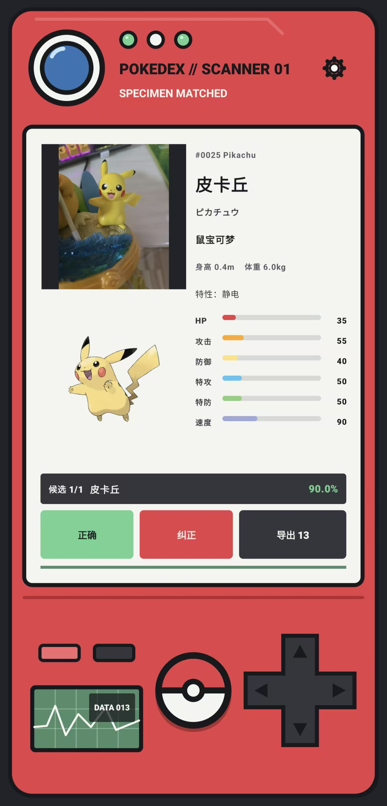

# Pokédex Scanner

一个面向 Android 的离线宝可梦图鉴扫描器。应用使用 Jetpack Compose 构建机械图鉴风格界面，通过 CameraX 拍摄图片，并在设备本地调用 MiniCPM-V 与 llama.cpp 完成识别。

> 本项目是独立的学习与研究项目，与 Nintendo、Game Freak、The Pokémon Company 没有官方关联。

## 应用展示



识别结果页面会保留拍摄原图，并展示当前宝可梦的编号、名称、属性、特性、六项种族值、候选概率和反馈操作。

## 主要功能

- CameraX 相机预览、拍照和系统照片选择器上传。
- 图片冻结显示：分析期间继续展示刚刚拍摄的原图。
- 本地 MiniCPM-V 视觉语言模型推理，不上传图片和模型数据。
- 单候选和五候选识别模式，候选结果严格校验为本地图鉴名称。
- 本地图鉴搜索、宝可梦详情页、形态数据和六项种族值展示。
- 中文 TTS 图鉴播报，可调节语速、音调、音量和音色预设。
- 扫描开始、识别成功、识别失败音效，并支持替换音频文件。
- 正确/纠正反馈、反馈数据导出和后续数据合并工具。
- 识别控制台：图片尺寸、JPEG 质量、token、线程、batch、上下文和解码参数。
- 红色按键打开完整图鉴，黑色按键返回相机页面；播报可被返回或重新拍照立即停止。

## 技术栈

| 模块 | 技术 |
| --- | --- |
| UI | Kotlin、Jetpack Compose、Material 3 |
| 相机 | AndroidX CameraX 1.6.1 |
| 本地推理 | C++17、Android NDK、CMake、llama.cpp、libmtmd |
| 模型 | MiniCPM-V 4.6 GGUF + mmproj 视觉投影模型 |
| 架构 | MVVM、StateFlow、Repository、JNI bridge |
| 支持设备 | Android 9/API 28 及以上，arm64-v8a |

## 本地模型下载

模型不打包进 Git 仓库，也不会随 APK 自动下载。请从 OpenBMB 官方 Hugging Face 页面下载：

- [MiniCPM-V-4_6-Q5_K_M.gguf](https://huggingface.co/openbmb/MiniCPM-V-4.6-gguf/blob/main/MiniCPM-V-4_6-Q5_K_M.gguf)
- [mmproj-model-f16.gguf](https://huggingface.co/openbmb/MiniCPM-V-4.6-gguf/blob/main/mmproj-model-f16.gguf)

下载后在应用的模型管理页面分别导入两个文件。Q5 量化版本比 Q4 占用更多内存；如果应用版本启用了严格的文件名、大小或 SHA-256 白名单，需要同步调整验证配置。

## 开发环境

- Android Studio Hedgehog 或更新版本
- Android SDK 36
- NDK `29.0.14206865`
- CMake `3.22.1`
- Node.js（用于生成图鉴目录和默认音效）
- 建议真机内存不低于 8 GB

## 构建项目

```powershell
node tools/generate_pokemon_catalog.mjs <dataset-root>
node tools/generate_default_sfx.mjs
.\gradlew.bat :app:testDebugUnitTest
.\gradlew.bat :app:assembleDebug
```

如果已有生成好的 `catalog.json` 和图片资产，可直接执行：

```powershell
.\gradlew.bat :app:assembleDebug
```

APK 输出位置：

```text
app/build/outputs/apk/debug/app-debug.apk
```

## 安装 APK

```powershell
adb install -r app/build/outputs/apk/debug/app-debug.apk
```

`-r` 会覆盖安装并保留应用数据、已导入模型和反馈记录。也可以在 [Releases](https://github.com/wuzixu2007/android-pokedex/releases) 页面下载发布版本。

## 项目结构

```text
pokedex/
├── app/
│   ├── build.gradle.kts                  Android 模块依赖和构建配置
│   └── src/
│       ├── main/
│       │   ├── AndroidManifest.xml       应用、相机和文件选择器配置
│       │   ├── assets/pokemon/            catalog.json 和宝可梦图片
│       │   ├── cpp/                      JNI 与原生推理桥接
│       │   │   └── third_party/llama.cpp  llama.cpp/libmtmd 及其许可证
│       │   ├── java/com/example/pokedex/
│       │   │   ├── MainActivity.kt       Compose 入口
│       │   │   └── ui/
│       │   │       ├── scanner/           扫描、识别、图鉴和设置功能
│       │   │       │   ├── ScannerScreen.kt
│       │   │       │   ├── ScannerShell.kt
│       │   │       │   ├── ScannerViewModel.kt
│       │   │       │   ├── ScannerState.kt
│       │   │       │   ├── CameraSession.kt
│       │   │       │   ├── RecognitionRuntime.kt
│       │   │       │   ├── ModelStore.kt
│       │   │       │   ├── PokemonCatalog.kt
│       │   │       │   ├── PokemonNarrator.kt
│       │   │       │   ├── SoundEffects.kt
│       │   │       │   ├── ScannerSettings.kt
│       │   │       │   └── FeedbackStore.kt
│       │   │       └── theme/              Compose 主题和颜色 token
│       │   ├── res/                       图标、音效、主题和 XML 资源
│       │   ├── test/                      JVM 单元测试
│       │   └── androidTest/               真机和 Compose 测试
├── docs/
│   ├── images/scanner-result.jpg         README 应用展示图
│   ├── APP_DEVELOPMENT.md                完整开发文档
│   └── ARCHITECTURE.md                   架构、模块和数据流文档
├── tools/
│   ├── generate_pokemon_catalog.mjs       生成紧凑图鉴目录
│   ├── generate_default_sfx.mjs           生成默认音效
│   └── merge_feedback.py                 合并用户纠正数据
├── gradle/                                版本目录和 Gradle Wrapper
├── build.gradle.kts                       根构建配置
├── settings.gradle.kts                    模块和仓库配置
├── gradlew / gradlew.bat                  可复现构建入口
├── .gitignore                             模型、本机配置、构建产物和隐私数据
├── LICENSE                                项目代码许可证
└── README.md                              项目说明
```

## 数据与隐私

- 图片识别默认完全在本地完成，不上传照片。
- GGUF 模型由用户手动导入，模型文件不进入 APK 和 Git 仓库。
- 反馈样本保存在应用私有目录，只有用户主动导出时才离开设备。
- `local.properties`、签名文件、模型文件和个人照片不会提交到仓库。

## 许可与第三方声明

项目自有代码使用 [Apache License 2.0](LICENSE)。`app/src/main/cpp/third_party/llama.cpp` 保留其原始许可证和 NOTICE 文件。宝可梦名称、图片、角色形象及相关数据归各自权利人所有，使用数据集和图片前请确认其授权范围。

## 参与贡献

欢迎提交 Issue 和 Pull Request。报告问题时请附上 Android 版本、设备型号、复现步骤和脱敏后的日志，不要上传个人照片、模型文件或隐私数据。

## 当前限制

- 本地 VLM 的识别准确率会受图片角度、遮挡、光线和模型量化影响。
- 当前模型输出的概率是模型自报置信度，不等同于经过校准的分类器概率。
- 首版只支持 ARM64 原生库，不包含云端识别、账号系统和识别历史同步。
