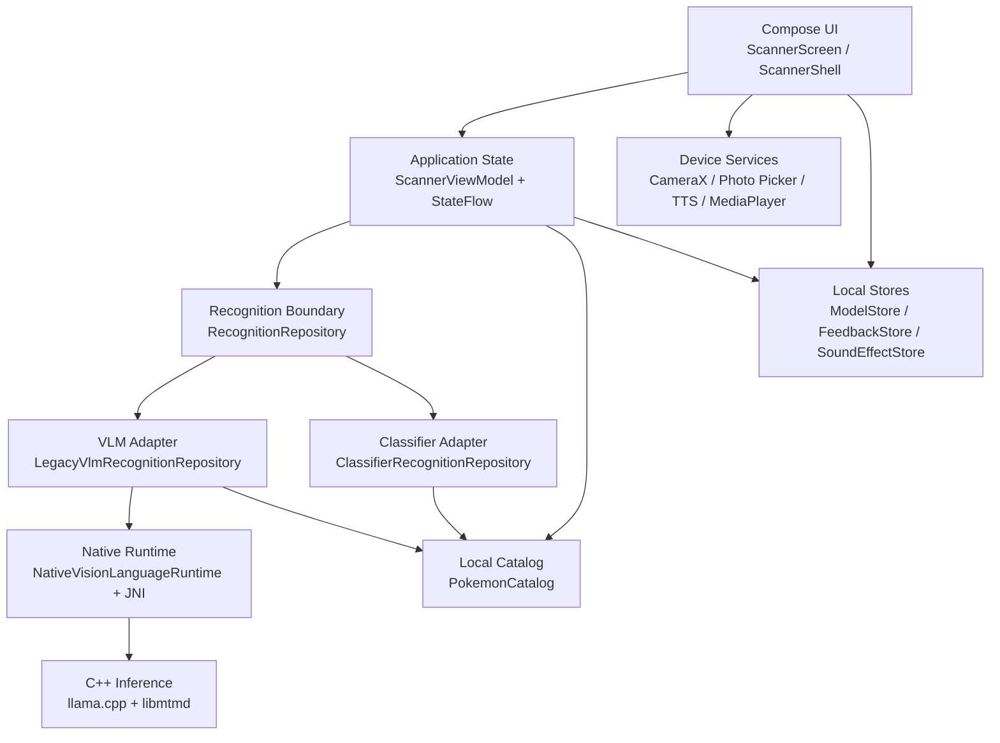
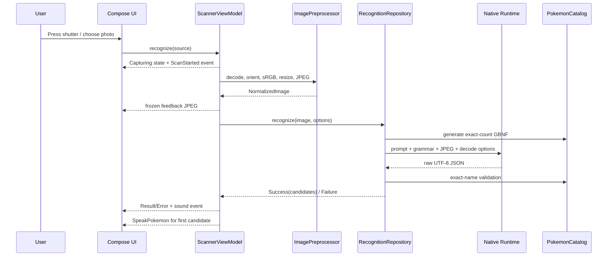
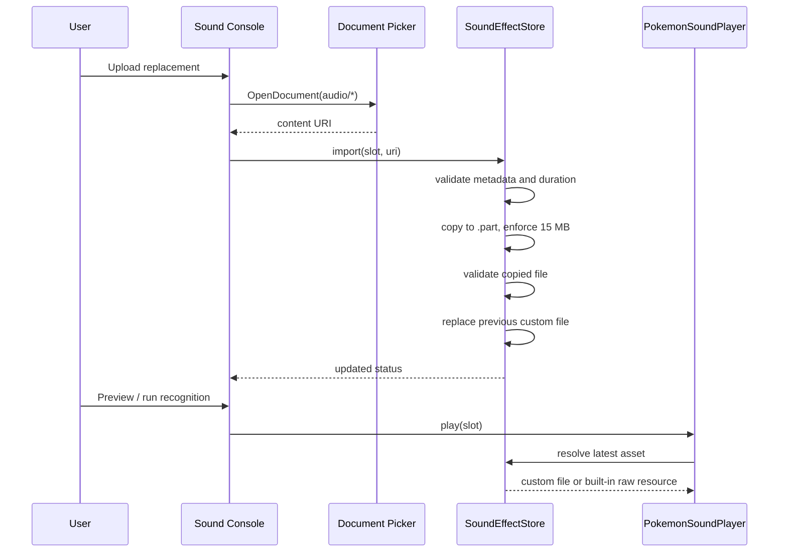

# Pokédex Scanner Architecture

> 项目架构结构文档 / Project Architecture Reference

## 1. Architecture Goals

- Offline-first recognition and local data ownership.
- UI state driven by immutable Kotlin models and `StateFlow`.
- Replaceable recognition engines behind repository/runtime interfaces.
- Strict separation between Compose UI, application orchestration, storage, and JNI.
- Atomic imports for large models, custom audio, and feedback artifacts.
- Testable reducers and protocol parsers without a camera or physical model.

## 2. Layer Diagram



## 3. Source Tree

```text
app/src/main/
├─ java/com/example/pokedex/
│  ├─ MainActivity.kt
│  └─ ui/
│     ├─ theme/
│     │  ├─ Color.kt
│     │  ├─ Theme.kt
│     │  └─ Type.kt
│     └─ scanner/
│        ├─ CameraSession.kt
│        ├─ FeedbackStore.kt
│        ├─ ModelStore.kt
│        ├─ PokemonCatalog.kt
│        ├─ PokemonNarrator.kt
│        ├─ RecognitionRuntime.kt
│        ├─ ScannerScreen.kt
│        ├─ ScannerSettings.kt
│        ├─ ScannerShell.kt
│        ├─ ScannerState.kt
│        ├─ ScannerViewModel.kt
│        └─ SoundEffects.kt
├─ cpp/
│  ├─ CMakeLists.txt
│  ├─ pokedex_inference.cpp
│  └─ third_party/llama.cpp/
├─ assets/pokemon/
│  ├─ catalog.json
│  └─ images/
└─ res/raw/
   ├─ scan_start.wav
   ├─ recognition_success.wav
   └─ recognition_failure.wav

tools/
├─ generate_pokemon_catalog.mjs
├─ generate_default_sfx.mjs
└─ merge_feedback.py

docs/
├─ APP_DEVELOPMENT.md
└─ ARCHITECTURE.md
```

`app/src/main/cpp/third_party/llama.cpp` is vendored third-party code. It is intentionally excluded from project-wide comment rewriting and style changes.

## 4. Module Responsibilities

### `MainActivity`

Single-activity entry point. Enables edge-to-edge rendering and hosts `PokedexScannerScreen` inside `PokedexTheme`.

### `ScannerScreen`

Compose presentation and Android activity-result integration:

- Camera permission launcher.
- Language/vision model document picker.
- Custom audio document picker.
- Dialog and page visibility.
- TTS and sound player lifecycle.
- Rendering scanner, catalog, settings, correction, and result content.

Composable functions do not run model inference directly.

### `ScannerShell`

Canvas-based mechanical enclosure and physical-control semantics. It owns the red/black controls, shutter, D-pad geometry, status lens, and responsive compact/expanded frame.

### `ScannerState`

Pure state contracts:

- `ScannerMode`: model setup, loading, permission, preview, capture, result, error.
- `ScannerPage`: scanner, catalog list, or catalog detail.
- `ScannerAction`: reducer input.
- `ScannerUiState`: single immutable UI snapshot.
- `reduceScannerState`: side-effect-free state transition function.

### `ScannerViewModel`

Application orchestrator:

- Observes model and feedback stores.
- Owns inference/load/test jobs.
- Applies timeout and cancellation.
- Preprocesses image input.
- Converts repository results to catalog indexes.
- Persists settings.
- Emits one-shot `ScannerEvent` values for notices, sharing, narration, and sound.

Long-running work uses `viewModelScope`; the Composable does not own inference jobs.

### `RecognitionRuntime`

Defines replaceable recognition boundaries:

```kotlin
interface RecognitionRepository {
    suspend fun loadModels(modelFiles: RecognitionModelFiles, options: ModelRuntimeOptions)
    suspend fun recognize(image: NormalizedImage, options: RecognitionOptions): RecognitionResult
    fun cancel()
    fun close()
}
```

Implementations:

- `LegacyVlmRecognitionRepository`: prompt + GBNF + MiniCPM-V path.
- `ClassifierRecognitionRepository`: future trained classifier path returning genuine top-K scores.

`VisionLanguageRuntime` isolates the JNI implementation from repository policy. This enables fake runtimes in unit tests and future engines without rewriting UI.

### `PokemonCatalog`

Loads compact local records, indexes exact Chinese names, resolves adjacent records, and generates candidate-count-specific GBNF grammars. Catalog names are the source of truth for output acceptance.

### `ModelStore`

Imports and validates two fixed GGUF files. It publishes `StateFlow<ModelSetStatus>` and exposes paths only when both files are verified.

### `FeedbackStore`

Persists normalized images and JSON metadata with SHA-256 deduplication. Writes are atomic and serialized with a coroutine `Mutex`. Export creates a portable ZIP.

### `PokemonNarrator`

Wraps Android `TextToSpeech`. It selects an installed offline simplified-Chinese voice where possible, applies speech rate/pitch/volume, and exposes a small `PokemonNarrator` interface.

### `SoundEffects`

Separates three concerns:

- `SoundEffectStore`: import, validation, status, reset, and asset resolution.
- `PokemonSoundPlayer`: playback interface used by UI.
- `AndroidPokemonSoundPlayer`: MediaPlayer implementation.

The player resolves the current file immediately before playback, so a successful replacement does not require an app restart.

## 5. Recognition Data Flow



## 6. Native Boundary

`NativeVisionLanguageRuntime` serializes model work on a dedicated executor and calls `NativeBindings`. JNI owns native handles and accepts only validated Kotlin options.

Model load order:

1. Initialize llama backend.
2. Load language GGUF.
3. Create llama context with context, batch, and thread options.
4. Load mmproj/libmtmd visual context compatible with MiniCPM-V 4.6.
5. Keep both contexts hot until reload or `close()`.

Inference order:

1. Decode JPEG through libmtmd.
2. Apply the image marker/template expected by MiniCPM-V.
3. Evaluate visual embeddings and prompt tokens.
4. Create grammar and penalty samplers.
5. Greedily generate up to `maxTokens`.
6. Return UTF-8 output only.

Cancellation uses an atomic flag observed by the native inference loop. Kotlin also applies a wall-clock timeout.

## 7. State and Event Separation

Persistent/display state is stored in `ScannerUiState` and collected as `StateFlow`. One-shot operations use `SharedFlow<ScannerEvent>`:

| Event | Consumer |
|---|---|
| `Notice` | Android Toast |
| `ShareFeedback` | Android share chooser |
| `SpeakPokemon` | `PokemonNarrator` |
| `PlaySound` | `PokemonSoundPlayer` |

This prevents toasts, speech, and sound from replaying after normal recomposition.

Catalog detail narration is emitted once by `ScannerViewModel.openPokemonDetail`. The Compose host calls `PokemonNarrator.stop()` synchronously before dispatching black-button or shutter actions, so speech termination never waits for page recomposition or utterance completion.

## 8. Settings Persistence

`ScannerSettings` is the typed aggregate:

```text
ScannerSettings
├─ RecognitionMode
├─ RecognitionTuning
├─ NarrationSettings
└─ SoundEffectSettings
```

`SharedPreferences` schema version 4 stores scalar settings. Runtime parameters are compared with `activeRuntimeOptions` to calculate `hasPendingRuntimeSettings`.

Custom audio files are not embedded in preferences. `SoundEffectStore` discovers validated files in `filesDir/sound_effects` and publishes display status through `ScannerUiState.soundAssets`.

## 9. Storage Layout

```text
filesDir/
├─ models/
│  ├─ MiniCPM-V-4_6-Q4_K_M.gguf
│  └─ mmproj-model-f16.gguf
├─ sound_effects/
│  ├─ scan_started.{ext}
│  ├─ recognition_success.{ext}
│  └─ recognition_failure.{ext}
└─ recognition-feedback/
   └─ samples/
      ├─ {uuid}.jpg
      └─ {uuid}.json

cacheDir/
└─ feedback-exports/
   └─ pokedex-feedback-*.zip
```

No custom audio or model is copied into APK assets at runtime.

## 10. Audio Replacement Flow



## 11. Extension Points

### Replace the recognition engine

Implement `RecognitionRepository` and select it in `ScannerViewModel`. UI, feedback, candidates, and catalog rendering remain unchanged. A trained image classifier should return calibrated top-K scores through `ClassifierPrediction`.

### Add a sound slot

1. Add an enum value to `AppSoundEffect`.
2. Add an original default file under `res/raw`.
3. Emit `ScannerEvent.PlaySound` at the required business transition.
4. No new console UI branch is required because the panel iterates enum entries.

### Add an offline voice-pack engine

Implement a new narrator behind `PokemonNarrator`. Keep TTS model import and runtime files in a dedicated store; do not mix voice packages with short application sound effects.

## 12. Dependency and Comment Policy

- First-party Kotlin, C++, build scripts, tools, and non-obvious logic use concise English/Chinese comments.
- Generated catalog JSON and binary WAV files are documented by their generators rather than commented internally.
- Vendored `third_party/llama.cpp` remains unmodified except for an intentional pinned upstream update.
- Comments describe contracts, invariants, ownership, and risk; they do not narrate obvious assignments.
